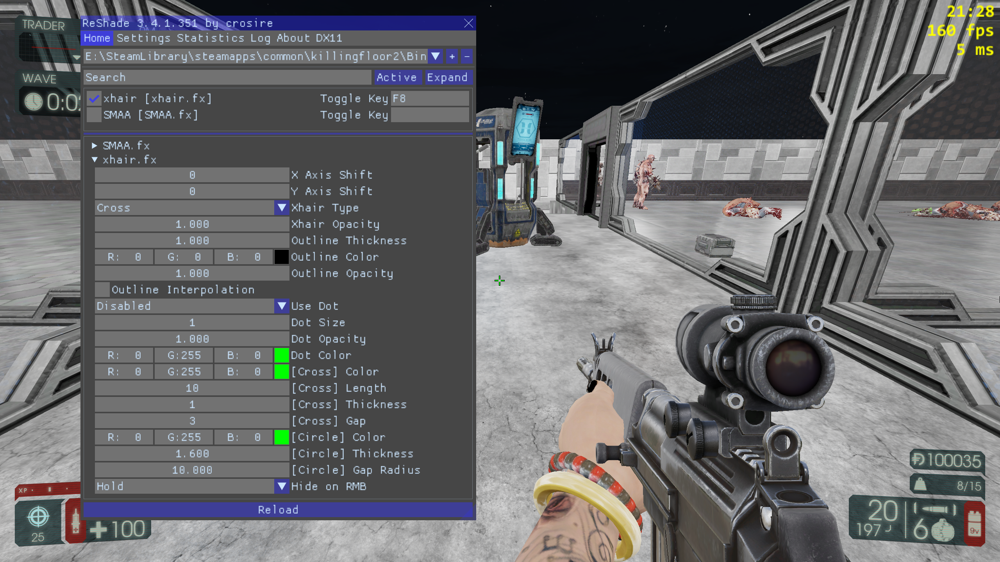
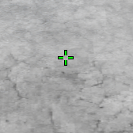
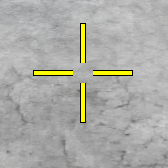
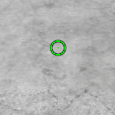
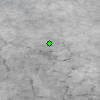

# reshade-xhair

ReShade Crosshair Shader Overlay

| Feature             | Supported               |
| ------------------- | ----------------------- |
| Fullscreen          | :heavy_check_mark:      |
| No input lag        | :heavy_check_mark:      |
| No FPS impact       | :heavy_check_mark:      |
| Customizable        | :heavy_check_mark:      |
| One-time setup      | :heavy_check_mark:      |
| Automatic updates   | :heavy_check_mark: &#42; |

&#42; through the Steam Workshop (only for Killing Floor 2)

## How to Install (for any game)

1. Download the latest version of the shaders (`shaders.zip`) from the [**Releases**](https://github.com/LouisTakePILLz/reshade-xhair/releases) tab on GitHub
2. Navigate to the folder that contains the **game executable** (e.g. `steamapps/common/killingfloor2/Binaries/Win64` for Killing Floor 2)
3. Extract the "shaders" folder (yes, the folder itself, **NOT the contents of it**) from `shaders.zip` to the game folder
4. Install ReShade 3.x (3.4.1 is recommended) from [`reshade-install/ReShade_Setup_3.4.1.exe`](https://github.com/LouisTakePILLz/reshade-xhair/blob/master/reshade-install/ReShade_Setup_3.4.1.exe).

    
    1. Click "Select game" and select your game executable (`KFGame.exe`) located under `steamapps/common/killingfloor2/Binaries/Win64`.
    2. Check the "Direct3D 10+" option.
    3. Click "No" when prompted with a "Yes/No" dialog about downloading standard shaders.
    4. Click "Edit ReShade settings".
        1. Change the "Effects Path" to the `shaders` folder (the same folder from **Step 3**)
        2. (optional) If you're familiar enough with ReShade, check "Skip Tutorial".
        3. Click "OK".
    5. Exit the ReShade installer.

5. Launch your game and open the ReShade overlay (Shift-F2 by default).
